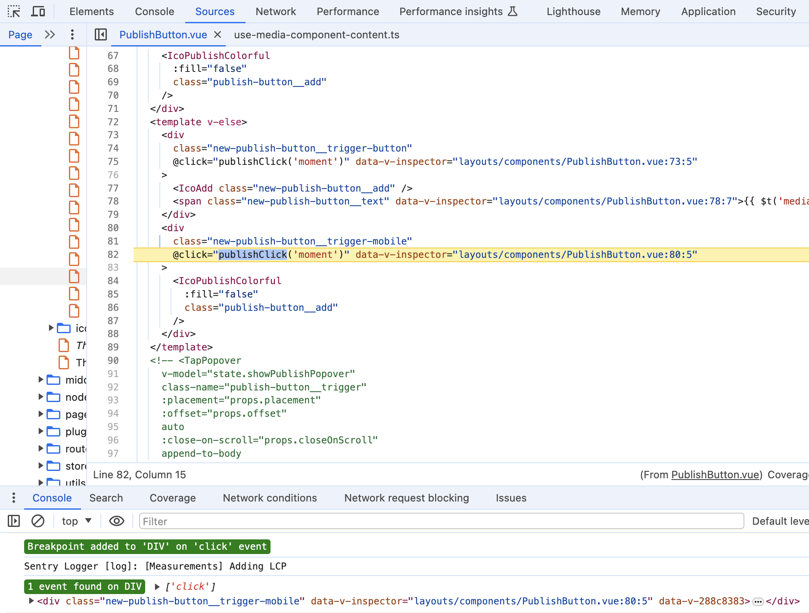
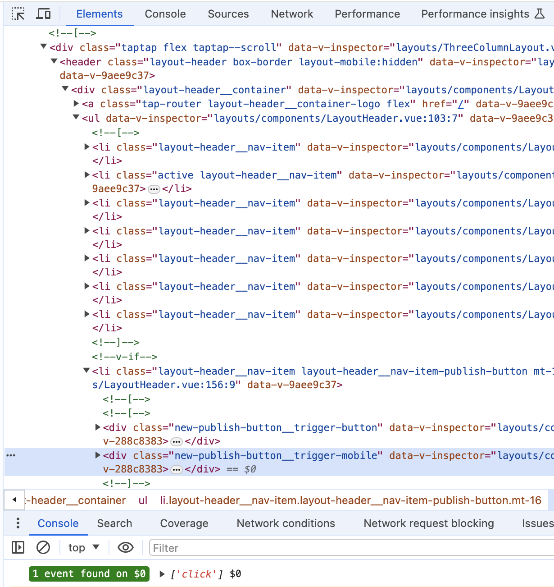
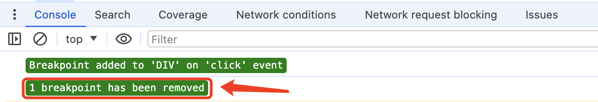

### 使用场景

插件主要功能点：从页面或Elements面板选择dom元素后，可以检测当前dom是否绑定事件，可以自动在dom的事件处理函数打上断点定位到源文件，方便开发调试。

从页面元素一键定位到源代码功能后续会增加。

### 功能说明

##### 右键Dom

页面任意地方右键，会检测当前右键元素上是否绑定了事件并打上断点，如果没有，会继续往上查找父节点直到body为止，同时控制台会输出操作结果。

##### 选中Dom

可以在Elements面板里选择需要检测或断点的dom节点，然后在页面任意地方右键，选择 `选中Dom` 菜单项，同时控制台会输出操作结果。

##### 取消Dom断点

在页面任意地方右键，选择菜单项，会把当前页面通过插件打上的断点都取消，同时控制台会输出操作结果。

##### 使用注意

1. 由于chrome的限制不能自动唤起控制台，需要先手动打开控制台后再使用domDebugger，不然插件功能无效；
2. 对于那些事件处理函数会被多重包装的场景，插件断点无法定位到业务代码，只能在处理函数的最外层打断点；